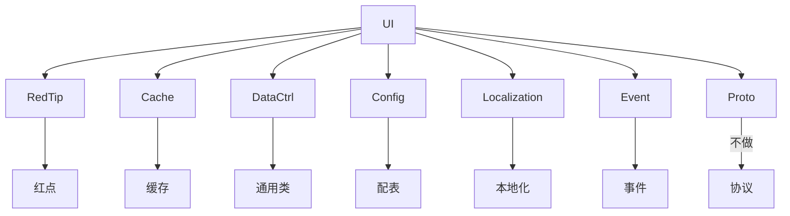

# ToDo 说明

- 本文列出需要做的内容；

# ToDo

- [ ] 工程规范
- [ ] 资源加载
- [ ] 流程图：

  辅助工具：[Mermaid Chart](https://www.mermaidchart.com/)

```mermaid
flowchart TB
    UI["UI"] --> RedTip["RedTip"] & Cache["Cache"] & DataCtrl["DataCtrl"] & Config["Config"] & Localization["Localization"] & Event["Event"] & Proto["Proto"]
    RedTip --> n1["红点"]
    Cache --> n2["缓存"]
    DataCtrl --> n3["通用类"]
    Config --> n4["配表"]
    Localization --> n5["本地化"]
    Event --> n6["事件"]
    Proto -- 不做 --> n7["协议"]
```

